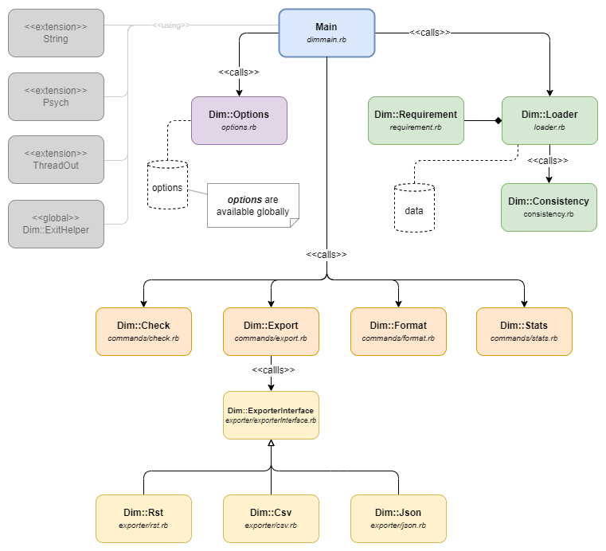

.. _dim_classes:

Classes
=======

    Class overview

The classes of Dim can be divided into six groups:

- **Main:** the entry point of this tool, it ties options, loader and subcommands together, see
  :ref:`main workflow <workflow_main>`.
- **Options:** loads the :ref:`options <workflow_parse_options>` from the command line and makes them
  globally available.
- **Loading and data storage:** These classes are responsible to :ref:`load <workflow_loader>` the
  requirements files and to provide the data to the subcommands.
- **Subcommands:** These :ref:`commands <workflow_execute_subcommand>` represent the central
  features of Dim:

    - Checking Dim files for :ref:`consistency <workflow_check>`.
    - :ref:`Exporting <workflow_export>` data to different formats.
    - :ref:`Formatting <workflow_format>` requirements files.
    - Printing :ref:`statistics <workflow_stats>`.
- **Exporters:** :ref:`Export <workflow_export>` is also a subcommand, but it's separated by output
  formats, namely :ref:`RST <workflow_export_rst>`, :ref:`CSV <workflow_export_csv>` and
  :ref:`JSON <workflow_export_json>`.
- **Helper classes:** These classes cover different use cases:

    - Providing convenient methods for string handling (String).
    - Helping to generate better error messages when loading the requirements files (Psych).
    - Simplifying the unit tests (ThreadOut, ExitHelper).
