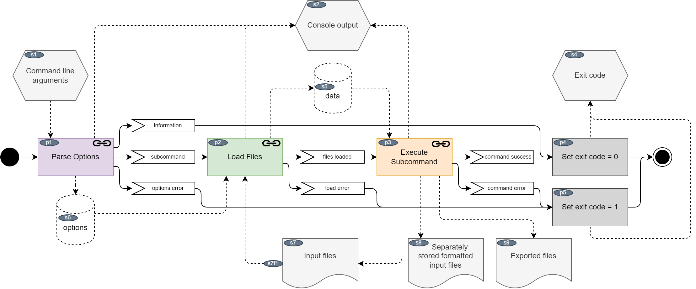
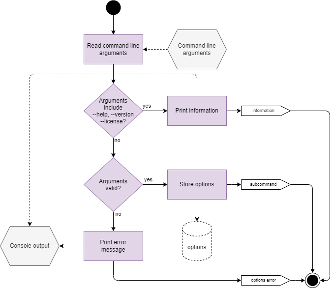
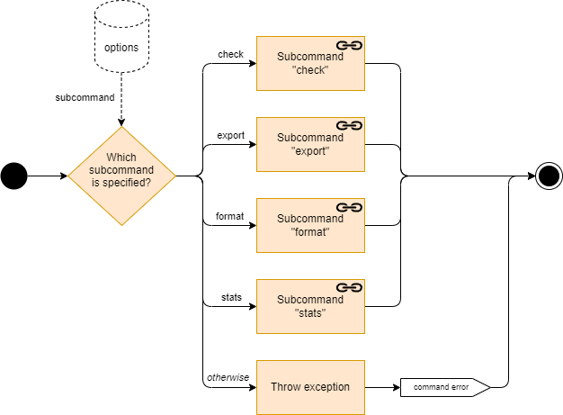
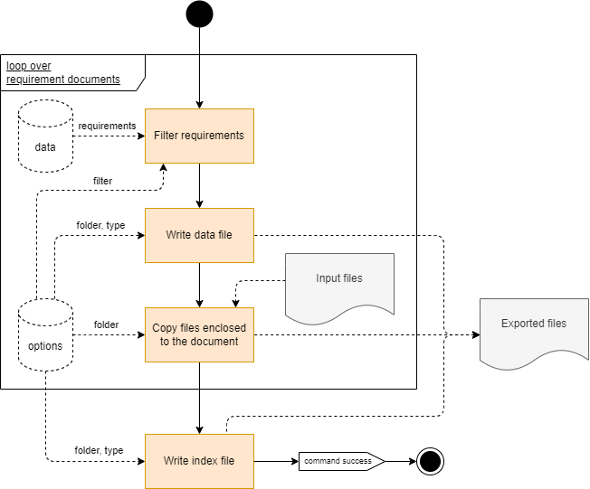
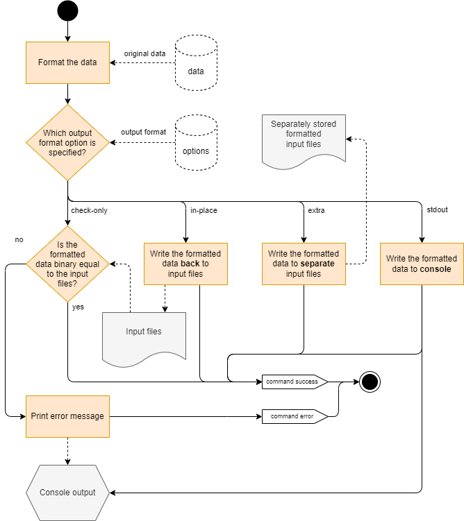
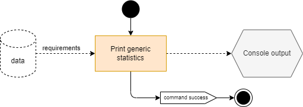

Dynamic Behaviour
=================

.. _workflow_main:

Main
----

This is the base workflow:

.. _workflow_main_fig:

    Main workflow

Notes:

- Not all subcommands require to load files, e.g. for printing the version.
- If any action fails, the exit code is set to 1 instead of 0.
- Exceptions are not caught. If a Ruby application terminates abnormally, the exit code is set to
  a value != 0 depending on the exception type.

.. _workflow_parse_options:

Parse Options
-------------

    Options

The outcome of this workflow can be either:

    - An option was found which causes the tool to gracefully exit immediately, e.g. after
      printing the license.
    - Parsing failed, e.g. something is missing, invalid or inconsistent.
    - All options successfully loaded and stored globally.

.. _workflow_loader:

Load Files
----------

.. figure:: ../../_static/swa/dynamic/loader.drawio.png
    :scale: 100%
    :align: center

    Loader

| **Load**:
| If a filename was specified in the options, this *loader* workflow is executed. The file can be
  a config file or a requirements file. A config file can refer to one or more requirements files.

| **Store**:
| Loaded requirements are harmonized, which means not specified attributes will become empty
  strings. This makes further processing easier.
  The result of this harmonization is called *original data* and stored in the loader instance.
  It is used by e.g. the *format* subcommand. Afterwards the default values get resolved and are set
  for empty attributes if applicable.

| **Check:**
| At the end the consistency is always checked, independently from the subcommand.

.. _workflow_execute_subcommand:

Execute Subcommand
------------------

    Subcommands

This part of the program flow is straight forward. Depending on the command line options, the
appropriate subcommand is executed. Invalid subcommand options were already handled in
:ref:`workflow_parse_options`.

.. _workflow_check:

Subcommand "check"
------------------

This subcommand is just a dummy and completely empty. The consistency check is always done when
:ref:`loading <workflow_loader>` the files.

.. _workflow_export:

Subcommand "export"
-------------------

    Exporting requirements

The files are exported to a specific output **folder** in a specific **type** specified with
command line options. A **filter** can be specified to export only a part of the requirements.
Files like images listed in the `enclosed` attribute of the input file are also copied to the output
folder.

The algorithm is always the same, but internally different implementations of the ExporterInterface
(see :ref:`dim_classes`) are called depending on the type which can be RST, JSON and CSV.

.. _workflow_export_rst:

RST
+++

Requirements are exported to Sphinx so that the `dox_trace` extension of Sphinx can understand the
content and generate a nice HTML view.

This is the only export type where an index file is generated (with the Sphinx `toctree` element).

.. _workflow_export_json:

JSON
++++

This exporter simply uses the Ruby JSON library to convert the requirement objects to JSON objects
which can be written to the output folder.

No index file is written.

.. _workflow_export_csv:

CSV
+++

The requirements are converted to a CSV format.

No index file is written.

.. _workflow_format:

Subcommand "format"
-------------------

    Formatting input files

The following types of formatting are possible:

- ``in-place``: See use case :ref:`use_case_change_requirements`.
- ``check-only``: Executed from the verifier in the :ref:`Version Control System <use_case_vcs>` use
  case.
- ``extra``: A debugging feature to write to separate files instead of changing the input files
  directly.
- ``stdout``: similar to `extra`, but writing the output to the console.

.. _workflow_stats:

Subcommand "stats"
------------------

    Printing statistics

This subcommand prints generic statistics of the requirements specified in the input files
like number of total number of requirements and number of accepted or rejected requirements.
