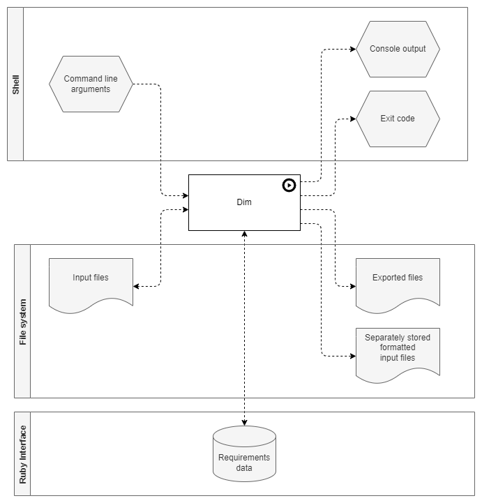

Input / Output
==============

.. _figuretest:

    Input / output

Dim is a command line tool, so it has

- **command line arguments** as input and
- **console output** and an **exit code** as output.

The file system is accessed

- to read and write the **input files**,
- to write **separately stored formatted input files** and
- to write **exported files**, e.g. in RST and CSV format.

Dim also provides a Ruby Interface to read and write **data** of the elements.
