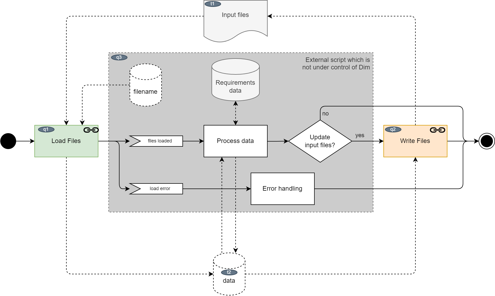
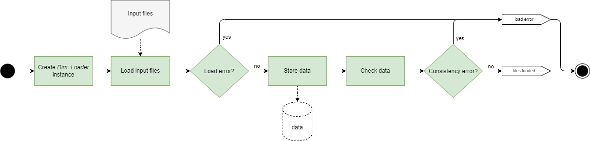
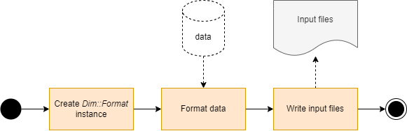

Scripting
=========

.. _workflow_scripting_main:

Main
----

This is the generic scripting workflow:

.. _scripting_main_fig:

    Generic scripting workflow

A script

- loads the input files,
- processes that data, e.g. to create statistics and
- writes the data back to the input files if needed using the Dim::Format class.

Note, that unexpected exceptions can occur anywhere in the code. These exceptions are not caught by
Dim. It's up to the script to do proper error handling. If the script does not catch the exception,
the Ruby interpreter will terminate the script with an exit code != 0.

Load Files
----------

    Load files

This is basically the same as the :ref:`regular loading workflow <workflow_loader>`.
The main difference is that the `Dim::Loader` instance needs to be created and called by the script.
Here a simplified version of the `regular loading workflow` is shown.

Write Files
-----------

    Write files

This is basically the same as the :ref:`regular format workflow <workflow_format>`.
The main difference is that the `Dim::Format` instance needs to be created and called by the script.
It's not intended to use other output-formats than `in-place` in a script. This makes the workflow
easier than the `regular format workflow`
