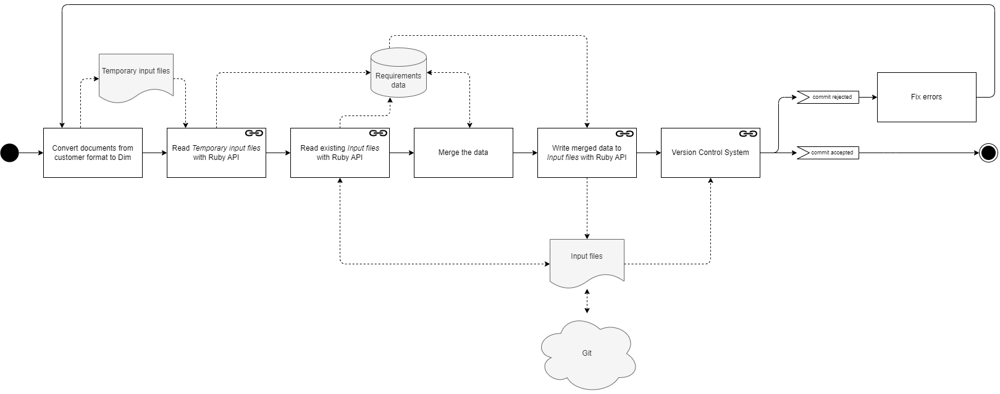
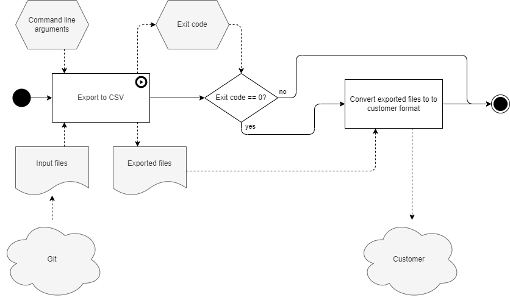
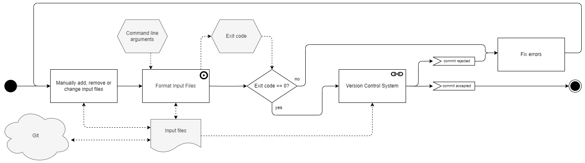
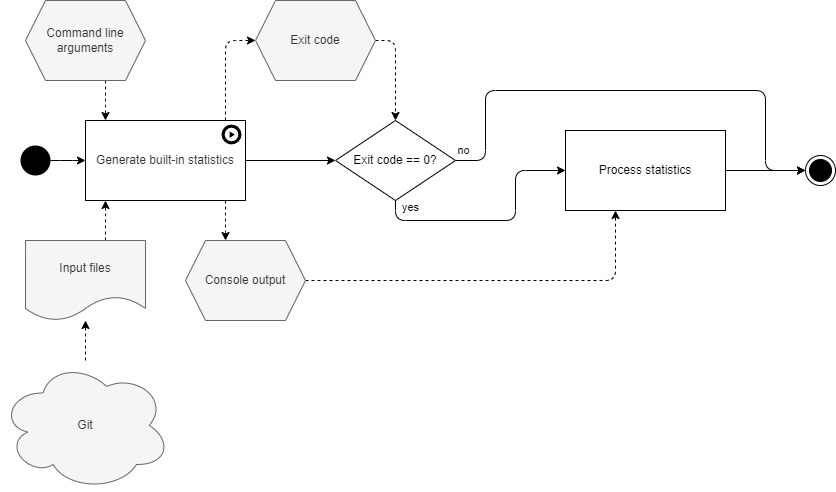
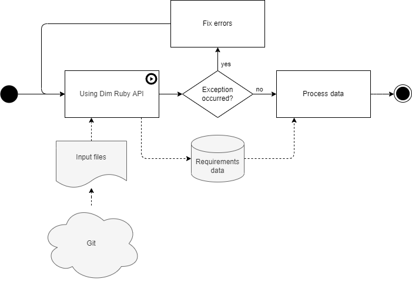
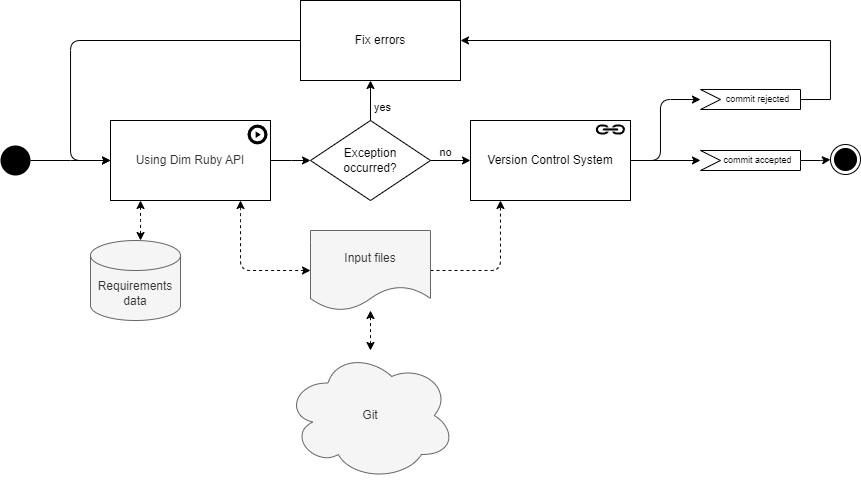
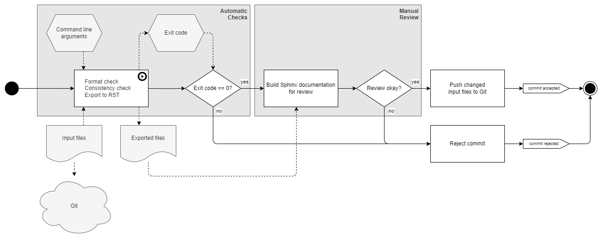

.. _use_cases:

Use Cases
=========

This page shows how Dim is used from a black box perspective.

Import from Customer
--------------------

Documents with requirements are received from customers, HW vendors etc. in different formats like
Doors.

- First, the documents are converted to Dim format, ``temporary input files`` are written.
- Then these ``temporary input files`` are read and merged with the already existing
  ``input files``. It must be defined, which attributes are owned by the customer and which
  are owned by project and under which conditions the the `review_status` has to be reset
  (e.g. when the customer changes the `text` attribute).
  In case the ``input files`` don't exist yet, the complete data from the ``temporary input files``
  are taken over.
- The result is written back to the ``input files`` which have to be verified.

    Import from customer

.. _use_case_export_to_customer:

Export to Customer
------------------

To provide changed requirements data to the customer, the data in Dim format is exported to CSV,
which is input for a conversion tool. The output of this tool is then sent to the customer.

    Export to customer

.. _use_case_change_requirements:

Change Requirements
-------------------

The following diagram shows the workflow when requirements are changed, e.g. customer requirements
are reviewed, software requirements written and improved, references are set, etc.

    Change requirements

Get Tool Information
--------------------

The following information can be printed:

- Dim version
- Command line usage
- License information

.. figure:: ../../_static/swa/usecases/data.drawio.png
    :scale: 100%
    :align: center

    Get tool information

Printing Built-In Statistics
----------------------------

To create (project) specific statistics, see use case :ref:`use_case_read_data`.

To get a quick overview of the input files without the need of writing a Ruby script, Dim can print
generic statistics like total number of requirements.

    Printing built-in statistics

.. _use_case_read_data:

Read Data with Ruby API
-----------------------

With the Ruby API, the requirements data can be read programmatically and further processed, e.g. to
monitor the progression of the requirements engineering activities by some scripts or to create a
traceability overview.

    Read data with Ruby API

Write Data with Ruby API
------------------------

Requirements data is written programmatically with the Ruby API.

    Write data with Ruby API

.. _use_case_vcs:

(Version Control System)
------------------------

.. note::

    **Version Control System** is not a use case by it's own, it's an activity which is performed by
    the use cases described above.

A `Version Control System` is a technical quality gate which must be passed before any changes are
merged into the Git repository. For the `input files` two stages are relevant:

- ``Automatic Checks``: This stage is also known as the "verifier" and checks the consistency and
  formatting of the input files. Additionally the data is exported to RST.
- ``Manual Review``: The RST files are used by Sphinx to build a HTML documentation which is very
  convenient in a review.

Only if everything is correct and the changes are approved by the reviewer, the commit is accepted
and merged to the Git repository.

    Version control system
