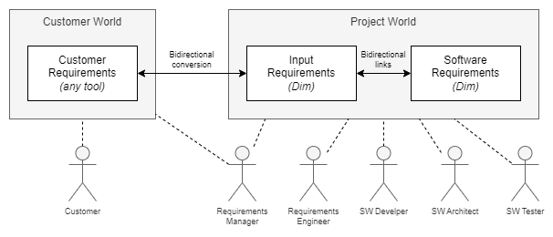

Introduction
============

Dim is a requirements tool to manually and automatically read, process and write requirements.
It was designed to simplify the work with requirements as much as possible.

Dim is written in Ruby and runs on :ref:`multiple platforms <compatibility>`.

Features
--------

- The data is represented by YAML files, a human-readable format which can be easily parsed by all
  common scripting languages.
- This format allows to read, change and write the files by any editor, whatever the author prefers.
  There is no restriction to any IDE. The files can be edited directly on local machines without
  having a (slow) VPN connection to a centralized server.
- The changes can be easily reviewed with an existing code review system.
- YAML files can be edited by several authors at the same time and merged as every regular text
  file when committing.
- The requirements can be maintained and baselined in the source code repository.
- Dim requires no license.
- The requirements can be structured in different files as well as in sections and subsections
  within a single file. Most of the attributes are very natural like the requirements `text`,
  `review_status`, `comment`, `refs` and so on.

Example requirements file:

.. code-block:: yaml

    SRS_memory_heading:         h1 Memory Usage

    SRS_memory_RAM:
      text:                     The ECU shall use a maximum of 80% of the available RAM in the first SOP.
      verification_criteria:        |
                                    The map-file includes information about the free RAM.
                                    This value must be >= 1 MB.
      tags: performance
      refs: SWA_memory_layout

    SRS_memory_ROM:
      text:                     The ECU ...

Dim is command line tool. The most important :ref:`subcommands <command_line_interface>` are:

- **check**: Checks the YAML files for syntactical correctness and consistency, e.g. whether all
  `refs` link to existing requirements.
- **format**: Formats files to have a standardized look and feel of the YAML files. Dim can also
  check whether the formatting is correct.
- **export** Exports the data to other formats, currently CSV, JSON and RST. The latter one is the
  import for a Sphinx build which generates a nice HTML representation of the requirements including
  clickable links etc.

Instead of providing a proprietary scripting language like DXL, Dim provides a
:ref:`Ruby interface <ruby_interface>` to make it very easy to process requirements automatically.
Typical use cases are:

- Creating project specific statistics, e.g. how many `Input Requirements` are not reviewed yet or
  which `Software Requirements` are security relevant.
- Changing a large set of requirements by a script, e.g. adding the development responsible for all
  requirements in a specific scope.
- Updating the requirements files with a new version of the customer requirement specification.

Harmonization
-------------

The attributes of Dim are predefined to simplify the requirement processes and to ease the reuse of
tools working with requirements. This does not only apply to self-written requirements, but also to
requirements provided by customers.

Customer requirements are often inconsistent in their attribute usage. They might be
delivered in different formats like ReqIf or PDF. Sometimes only meeting minutes from workshops
exist which much serve as input. Not everything is provided directly by the customer, often
third-party requirements like safety manuals from the HW vendor or ISO specifications must be
handled.

To avoid that every project member has to deal with these difficulties, the `Requirements Manager`
converts the `Input Requirements` into the Dim format and vice versa. All subsequent tasks are done
with the Dim files.

