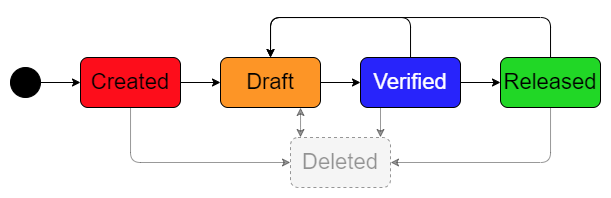

.. _sphinx_document_status:

Document Status
===============

Lifecycle Model
---------------

Documents like guidelines or project documentations have a lifecycle.
This extension provides four different states for a Sphinx document:

.. list-table::
    :widths: 8 92

    * - .. rst-class:: header-label document-status-created

            Created
      - The document is in a very early stage, incomplete and potentially includes wrong
        information.
    * - .. rst-class:: header-label document-status-draft

            Draft
      - The document was reviewed and is already in a good shape.
        Some parts may still be missing but the existing information is reliable.
    * - .. rst-class:: header-label document-status-verified

            Verified
      - The document is complete and trustworthy. No review findings are open.
        It was also checked regarding formal aspects.
    * - .. rst-class:: header-label document-status-released

            Released
      - The document is approved and valid.

Usually a document lifecycle also consists of a status like *Under Review*, but if pull requests
are reviewed within a review tool before being merged, this status is not explicitly needed for
published Sphinx files.

The status can be changed at any time. But every status change should be reviewed within a review
tool before being merged. This also applies when deleting the document.

A typical lifecycle looks like this:

Setting a State
---------------

To enable the documentation status label, set a default value in ``conf.py`` like this:

.. code-block:: python

    html_context = {"document_status_default": "Draft"}

To overwrite the status of a document add the following directive at the top of the rst-file:

.. code-block:: rst

    :document_status: <status>

Example:

.. code-block:: rst

    :document_status: Released

    Some Title
    ==========

    Some text...

Aliases
-------

The following states are mapped automatically when using in RST files:

- *Raw* --> *Created*
- *Valid* --> *Released*
