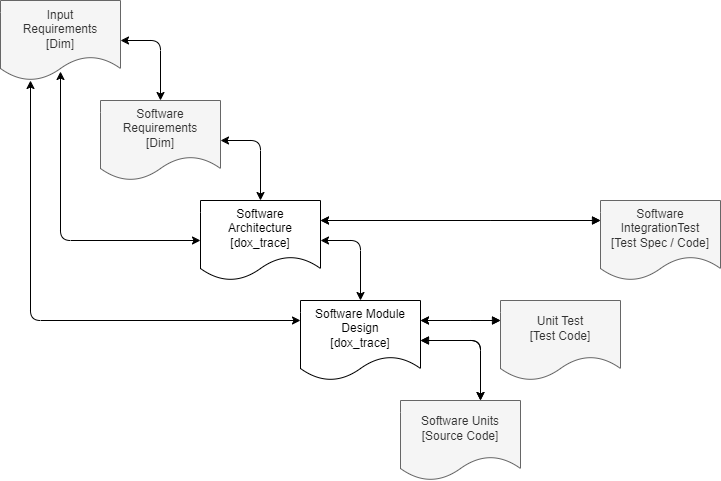

dox_trace
=========

dox_trace is a Sphinx extension to achieve traceability in software projects.

If you are new to this extension, please begin with **Getting Started**. This chapter provides an
introduction to this tool, explains how to install it and what is required to successfully integrate
*dox_trace* into the project's toolchain.

The **User Documentation** is obviously the main source of information for users of this extension.
It describes details like the syntax and which values are calculated.

Maintainers, testers, functional safety managers and whoever wants to know more about the internals
of this tool please refer to **Requirements**, **Architecture** and **Development of dox_trace**.

.. toctree::
   :maxdepth: 1
   :caption: Getting Started
   :hidden:

   pages/started/introduction
   pages/started/installation
   pages/started/integration

.. toctree::
   :maxdepth: 1
   :caption: User Documentation
   :hidden:

   pages/user/directives
   pages/user/explicitAttributes
   pages/user/customAttributes
   pages/user/calcedValues
   pages/user/parentValues
   pages/user/newlines
   pages/user/rawhtml
   pages/user/properties
   pages/user/traceability
   pages/user/export
   pages/user/config
   pages/user/enclosed
   pages/user/unintended
   pages/user/backward

.. toctree::
   :maxdepth: 1
   :caption: Examples
   :hidden:

   pages/examples/specifications
   pages/examples/report
   pages/examples/undefined_refs

.. toctree::
   :maxdepth: 1
   :caption: Requirements
   :hidden:

   pages/requirements-generated/dox_trace/Requirements
   pages/requirements-generated/mapping
   pages/requirements-generated/stats
   pages/requirements/reqConfig

.. toctree::
   :maxdepth: 1
   :caption: Architecture
   :hidden:

   pages/architecture/inout
   pages/architecture/usecases
   pages/architecture/static
   pages/architecture/dynamic
   pages/architecture/fmea
   pages/architecture/legend

.. toctree::
   :maxdepth: 1
   :caption: Development of dox_trace
   :hidden:

   pages/development/ci
   pages/development/bugTracking
   pages/development/release

.. toctree::
   :maxdepth: 1
   :caption: Appendix
   :hidden:

   pages/appendix/changelog
   pages/appendix/config
