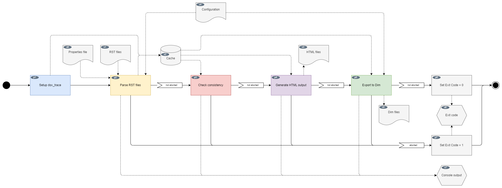
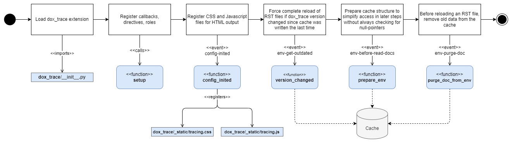
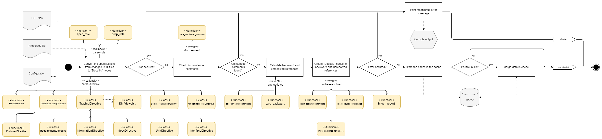
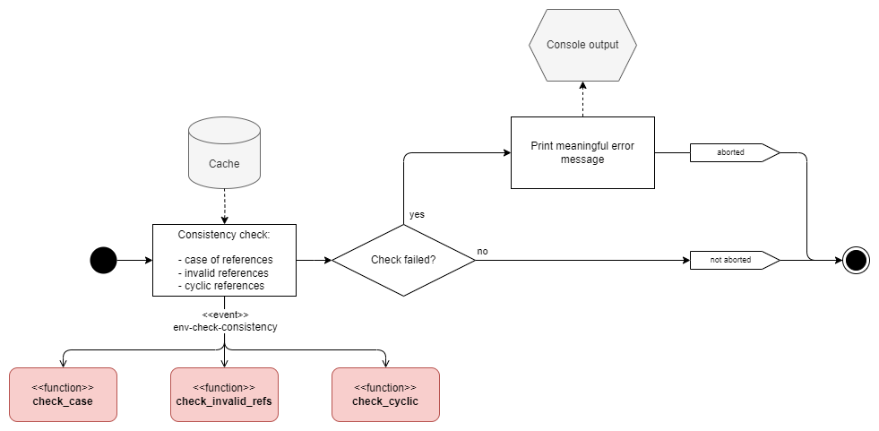
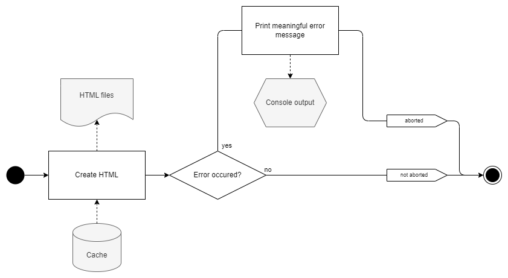
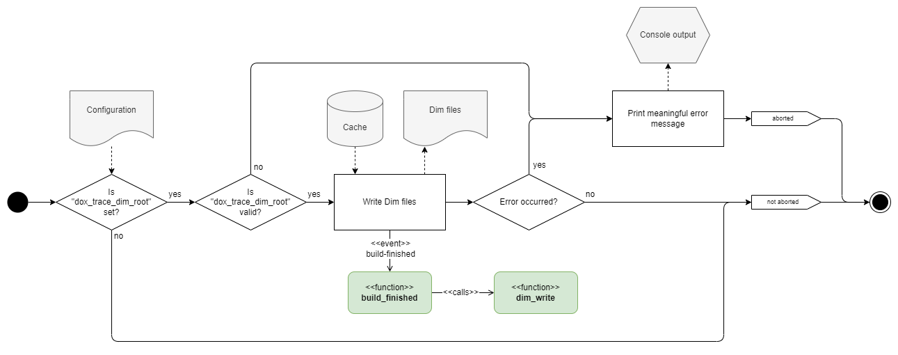

Dynamic Behaviour
=================

.. _workflow:

Main Workflow
-------------

The main workflow is a sequence of five major steps which are explained in more detail in the
sections below.

.. _workflow_main_fig:

    Main workflow

All input and output is directly accessed by the user of this tool except the **cache**.
The cache is created by Sphinx to increase the speed of incremental builds. Files which have not
changed since the last build usually don't have to be read again. *dox_trace* enriches the cache
with *specification* data to resolve references, perform consistency checks and export data to
*Dim*.

In general, **exceptions** are not caught. If an exceptions occurs, Sphinx terminates and sets the
exit code to a value != 0 depending on the exception type.

.. _setup_dox_trace:

Setup dox_trace
---------------

    Setup dox_trace

Setting up *dox_trace* is straightforward:

- First, the source files are loaded by the Python interpreter.
- Afterwards Sphinx calls the *setup* function which is mandatory for every extension. This function
  registers callbacks to certain Sphinx events, directives and roles.
- The first event is *config-inited* which allows to add additional stuff to the Sphinx
  configuration. *dox_trace* registers a CSS and a Javascript file for the HTML output.
- If the *dox_trace* extension itself has changed, it is not ensured that the data in the cache is
  still compatible, so *dox_trace* enforces a reload of all RST files.
- The cache, internally also called *environment*, is getting prepared by creating some data
  structures which are used later by dox_trace.
- Data from RST files which are going to be read again is deleted from the cache.

Parse RST Files
---------------

    Parse RST files

After the *environment* is prepared in :ref:`setup_dox_trace`, the new and changed RST files can be
read:

- Sphinx calls the registered classes and functions for the following elements found in RST files:

    - most importantly the *specification* directives:

        - ``.. requirement::``
        - ``.. information::``
        - ``.. srs::``
        - ``.. spec::``
        - ``.. mod::``
        - ``.. interface::``
        - ``.. unit::``

    - the ``.. dox_trace_config::`` directive which generates a page to configure the appearance of
      the *specifications*
    - the ``.. traceability_report::`` directive which generates a traceability report
    - the ``.. unresolved_refs::`` directive which generates a list of specifications with
      unresolved references
    - the ``.. prop::`` directive and ``:prop:`` role which display a property
    - internally used roles to create nice literals in HTML output with type and ID of
      *specifications* which can be linked by regular Sphinx references.

  These functions convert the data to "Docutils" nodes, the underlying document structure used by
  Sphinx.

- The Sphinx syntax for directives is very close to the comment syntax, which means a
  *specification* may be commented out unintentionally. To avoid that, a check is implemented to
  find comments which look similar to a *specification* directive.
- After all files are parsed, upstream and downstream references can be calculated. They are
  injected into the already created "Docutils" node structure.
- Finally the data is stored in the cache.
- In parallel (multi-threaded) builds a separate cache section is created by Sphinx for every parsed
  RST files to avoid critical sections. After reading all files, these sections must be merged.
- If an error occurs, a meaningful error message is printed out and the build is aborted.

Check Consistency
-----------------

    Check consistency

After all data is loaded, the following checks are performed:

- References in Sphinx are internally converted to lower case, which means the references are
  case insensitive. But when exporting to *Dim*, the case matters, so *dox_trace* ensures that the
  case is always correct.
- *Specifications* can link to other *specifications* using their ``refs`` attribute. dox_trace
  ensures that the targets are really *specifications* and not regular Sphinx anchors.
- Cyclic references are disallowed to avoid problems in further processing of the data like
  generating metrics.

If a check fails, a meaningful error message is printed out and the build is aborted.

Generate HTML Output
--------------------

    Generate HTML output

This step is completely done by Sphinx, the *dox_trace* extension is not involved directly. In case
of an error, Sphinx prints an error message and aborts the build.

Export to Dim
-------------

    Export to Dim

If the Sphinx configuration includes a variable ``dox_trace_dim_root`` pointing to a valid
directory, *dox_trace* exports the *specification* data of srs, spec, mod, interface and unit to
*Dim* files. If an error occurs, a meaningful error message is printed out and the build is aborted.
