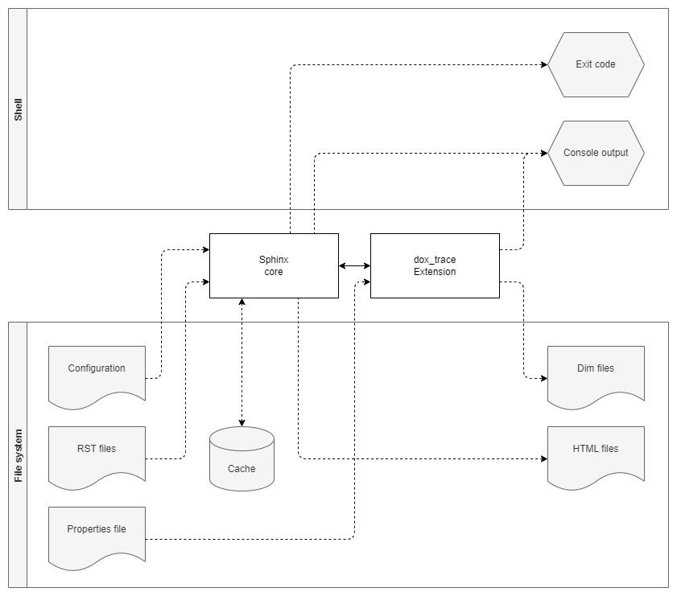

Input / Output
==============

.. _figuretest:

    Input / output

*dox_trace* is a Sphinx extension, which means most of the input and output goes through the Sphinx
API.

File System
-----------

- Sphinx parses **RST files** which may contain *specifications*. For every found *specification*,
  callbacks are executed which are registered by *dox_trace* during the init-phase of the extension.
- Attribute values for *specifications* can be predefined in a **properties file**.
- These *specifications* are converted to *Docutils* nodes and stored by Sphinx in a **cache**.
- The cache is used by *dox_trace* to resolve references and to export the data to **Dim files**.
- This export is only done if the optional configuration parameter ``dox_trace_dim_root`` is set
  in the Sphinx **configuration**.
- Sphinx generates **HTML files** representing the RST files including the *specifications*.

Shell
-----

- *dox_trace* has no command line option, but the **exit code** of Sphinx is != 0 whenever it
  detects an error.
- If an error is detected, *dox_trace* uses **console output** to provide more information about the
  error.
