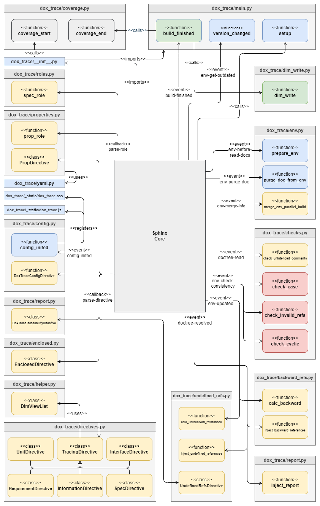

Classes and Functions
=====================

Overview
--------

    Static overview

| This diagram shows all files of the *dox_trace* extension.
| The colors shall help to identify which parts are used in which step of the :ref:`workflow`.

Files
-----

- **dox_trace/_static/dox_trace.css**: Some style sheets to layout *specifications*.
- **dox_trace/_static/dox_trace.js**: Javascript code used by the config directive.
- **dox_trace/_static/yaml.py**: Helper to load YAML files.
- **dox_trace/__init__.py**: Technically the entry point of the dox_trace extension, following the
  Python standard. It wraps the unit test code coverage functionality around the *main.py* file.
- **dox_trace/backward_refs.py**: Upstream and downstream references to *specifications* can only be
  calculated after all RST files are read, which means the data has to be injected into the
  "Docutils" node-tree.
- **dox_trace/checks.py**: Contains additional consistency checks.
- **dox_trace/config.py**: Registers the CSS and Javascript files and provides a config directive
  which makes it possible to hide/show groups of attributes on-the-fly in already generated HTML
  files.
- **dox_trace/coverage.py** The content of this file is usually not part of the extension, it's
  opted-in by the unit test to measure the code coverage.
- **dox_trace/dim_write.py**: Exports the *specifications* to Dim files.
- **dox_trace/directives.py**: Most of the source code of this extension can be found in this file.
  It consists of the *specification* directives which convert the textual representations of the
  *specifications* into "Docutils" nodes for further processing by Sphinx like generating the HTML
  files.
- **dox_trace/enclosed.py**: Provides the *enclosed* directive to copy files to the output folder.
- **dox_trace/env.py**: Simplifies the access of the Sphinx cache.
- **dox_trace/helper.py**: Used to understand parts of the *specifications* which already uses Sphinx
  syntax.
- **dox_trace/main.py** Connects to different Sphinx events and triggers additional checks as well
  as the Dim export.
- **dox_trace/properties.py** Provides a role and a directive to use properties standalone outside
  *specifications*.
- **dox_trace/report\*.py**: These file are used to generate the traceability report.
- **dox_trace/roles.py**: Consists of roles which are temporarily used for a nicer HTML output of the
  *specifications*.
- **dox_trace/undefined_refs.py**: List of unresolved references can only be calculated after
  all RST files are read, which means the data has to be injected into the "Docutils" node-tree.

Sphinx API
----------

*dox_trace* uses callbacks from the Sphinx *Application API* and the *Event Callbacks API* as
annotated in the diagram above. Please refer to the official Sphinx documentation to get more
information about the Sphinx procedures, especially when which event happens during a build:

- Application API: https://www.sphinx-doc.org/en/master/extdev/appapi.html
- Event Callbacks API: https://www.sphinx-doc.org/en/master/extdev/event_callbacks.html
