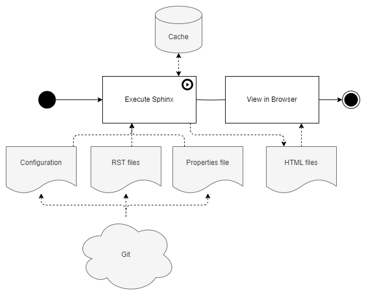
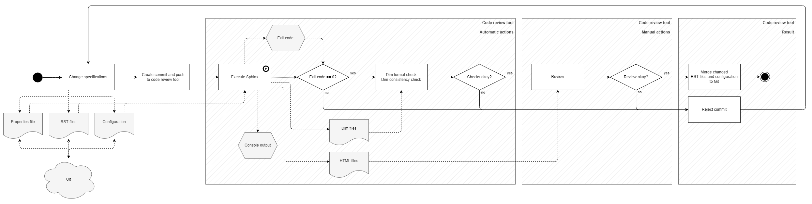

.. _use_cases:

Use Cases
=========

This page shows how dox_trace is used from a black box perspective.

Generating HTML
---------------

Existing RST files including *specifications* are converted to HTML by executing Sphinx. The
resulting HTML files can then be viewed in a browser.

    Generating HTML

Calculating Metrics
-------------------

*Specifications* in existing RST files are exported to Dim format by executing Sphinx. With Dim
files various metrics can be calculated using the Dim Ruby API.

It's explicitly allowed to process the Dim files for any other purpose, not only for calculating
metrics.

    Calculating metrics

.. _changing_specifications:

Changing Specifications
-----------------------

RST files are text files, which can be changed by any editor. This requires to verify the changes:

- Most of the errors like using an unknown attribute or cyclic references can be found by executing
  Sphinx and checking the exit code and if necessary the console output.
- The values of the attributes can be *syntactically* verified by exporting to Dim format and
  running the Dim checks.
- The generated HTML can be used to double check that the content is *semantically* correct.

.. figure:: ../_static/swa/usecases/usecase_change.drawio.png
    :scale: 100%
    :align: center

    Change specifications

Publishing Changes
------------------

This is similar to the :ref:`changing_specifications` use case. Instead of a local verification and
a self-review, the changes are pushed to a code review tool to trigger an official verifier and let
others review the changes. If both is successfully completed, the changes are merged into the
corresponding Git branches.

    Publishing changes
