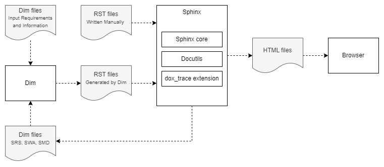

Introduction
============

Overview
--------

`Sphinx <https://www.sphinx-doc.org/>`_ is a tool to "create intelligent and beautiful documentation
with ease". It uses `reStructuredText  <https://docutils.sourceforge.io/rst.html>`_ as its markup
language, and many of its strengths come from the power and straightforwardness of reStructuredText
and its parsing and translating suite, the `Docutils <http://docutils.sourceforge.net/>`_.
`Extensions <https://www.sphinx-doc.org/en/master/usage/extensions/index.html>`_
can add or change functionality.

The *dox_trace* extension provides new directives for the RST files, the so called
**specifications**.

Specifications are containers which can include any content like text, images or even headings.
These containers can be enriched with several attributes similar to **Dim**, e.g. *status*, *asil*,
or *refs*. All attributes have default values which are used if not specified explicitly. The only
mandatory attribute from tooling perspective to build the documentation is the *ID*.

This ID acts as anchor and can be referenced by other specifications and regular Sphinx links.
These references are needed to get a full :ref:`traceability <spec_trace>` from requirements through
software architecture and detailed design down to code and tests.

Feature Highlights
------------------

- :ref:`Specification <spec>` directives for ``requirement``, ``information``, ``srs``, ``spec``,
  ``mod``, ``interface`` and ``unit``.
- Generation of a :ref:`traceability report <generate_traceability_report>`.
- :ref:`Export <spec2dim>` to Dim.
