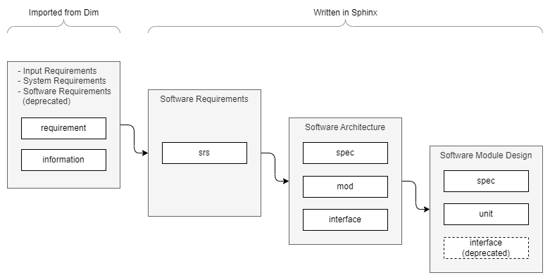

.. _spec:

Specification Directives
========================

.. _spec_types:

Types
-----

Five types are provided for manually written specifications:

- ``srs`` A **software requirement**, usually derived to specs. A srs needs to be tested.
- ``spec`` An **architectural** or **design specification**, e.g. a use case or resource usage.
  It does not directly link to source code but needs to be refined and linked to other specs, mods,
  interfaces or units. A spec needs to be tested.
- ``mod`` A **software module**. This element has an informative nature, it links to the module
  documentation and provides a brief description of the module. It does not need to be tested
  directly.
- ``interface`` An **interface** between two modules in the architecture. Needs to be linked to
  the caller unit, the callee unit and if applicable to the interface unit. Interface tests are
  obligatory. |br| *The usage in software module design is deprecated.*
- ``unit`` A **single functionality**, which is not split any further, usually a
  class or a function. It refers to source code and is tested.

Two additional types of are not intended to be used manually. They are generated by Dim when
exporting data to reStructuredText.

- ``requirement`` An **input requirement**, **system requirement** or a **software requirement**.
  Requirements have to be linked to the software architecture and software module design.
  Note, that software requirements in Dim are deprecated, write them in Sphinx directly as *srs*.
- ``information`` Additional **non-binding** information.

See :ref:`spec_trace` chapter for information about how to connect these elements.

If you use ``interface`` with an ID starting with ``SMD_``, an error will be raised during the
build. To skip that check, set the variable *dox_trace_allow_deprecated* in ``conf.py`` to *True*:

.. code-block:: python

    dox_trace_allow_deprecated = True

Syntax
------

To create a specification, use one of the following the directives:

- ``.. srs:: <unique_id>``
- ``.. spec:: <unique_id>``
- ``.. mod:: <unique_id>``
- ``.. interface:: <unique_id>``.
- ``.. unit:: <unique_id>``

The **description** is placed into the **content** part of the directive. It can be **simple text**
or any other **complex Sphinx syntax** including headings.
In the following example many :ref:`attributes <dim_attr>` are shown automatically, which are
explained in further sections on this guideline page.

The ID is rendered as HTML link to itself, so the anchor can be simply copied from the address bar
of the browser and e.g. pasted into a ticket.

**Example**

*rst:*

.. code-block:: rst

    .. srs:: SRS_topic_aspect

        Description of the **srs**.

    .. mod:: SWA_mod_name

        Description of the **mod**.

    .. spec:: SWA_feature_id1

        Description of the **spec**.

        .. image:: ../_static/example.png

    .. interface:: SWA_feature_id2

        Description of

        the **interface**.

    .. unit:: SMD_module_classX

        Description of
        the **unit**.

*html:*

.. srs:: SRS_topic_aspect

    Description of the **srs**.

.. mod:: SWA_mod_name

    Description of the **mod**.

.. spec:: SWA_feature_id1

    Description of the **spec**.

    .. image:: ../_static/example.png

.. interface:: SWA_feature_id2

    Description of

    the **interface**.

.. unit:: SMD_module_classX

    Description of
    the **unit**.

.. _naming_convention:

Naming Convention of IDs
------------------------

The naming convention of IDs is independent from the type. The names must be **unique**.
Use short but concise strings.

- **Software Requirements:** ``SRS_<topic>_<id>``
- **Software Architecture:** ``SWA_<aspect/feature>_<id>`` |br|
  For mods use: ``SWA_mod_<moduleName>``
- **Software Module Design:** ``SMD_<moduleName>_<id>`` |br|
  For units use the class name and/or method name:
  ``SMD_<moduleName>_<className>::<methodName>``

Examples:

.. code-block:: rst

    .. srs:: SRS_Deployment_FunctionalSafety

    .. mod:: SWA_mod_xcpEthernetAdapter

    .. spec:: SWA_XCP_Paging

    .. unit:: SMD_xcp_XcpSlave

    .. unit:: SMD_xcp_XcpSlave::dispatcher

Sphinx Links
------------

The specifications can be **referenced** from any other location using the regular Sphinx ``ref``.
Note, that a ``ref`` is only a simple link to navigate through the documentation. The default
display name is the last part of ID.

**Example**

*rst:*

.. code-block:: rst

    Links to
    :ref:`SMD_module_classX`,
    :ref:`SRS_topic_aspect <SRS_topic_aspect>` and
    :ref:`some text <SWA_feature_id1>`.

*html:*

.. list-table::
    :width: 100%
    :header-rows: 0

    * - Links to
        :ref:`SMD_module_classX`,
        :ref:`SRS_topic_aspect <SRS_topic_aspect>` and
        :ref:`some text <SWA_feature_id1>`.

To add references for :ref:`traceability <spec_trace>`,
use the :ref:`spec_attr_refs` attribute of the specification directives.
